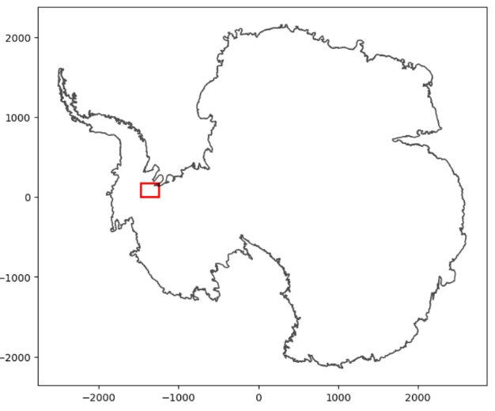
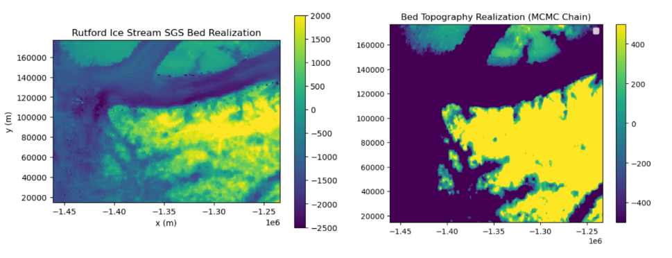

# Bed Topography of the Rutford Ice Stream
### Authors: Laila Zaidi, Dr. Emma (Mickey) MacKie, Niya Shao

This repository contains the full workflow for generating stochastic realizations of Rutford Ice Stream's bed topography and ice thickness through a new approach that uses geostatistical methods, particularly the Markov chain Monte Carlo (MCMC).

This study is focused on the Rutford Ice Stream, located in West Antarctica, which flows rapidly between the Ellsworth Mountains and the Fletcher Promontory and into the Ronne Ice Shelf. Its fast flow speed, deep basal trough, and sensitivity to upstream and downstream forcing make it an ideal study site for exploring uncertainty in subglacial conditions.

---

## Study Area
The Rutford Ice Stream is one of the most powerful ice streams on the continent, flowing ~1 km/year. Its deeply eroded trough, constrained by narrow mountain walls, makes its subglacial topography both difficult to measure and essential for ice-dynamic modeling (Doake et al.).

---

## Project Overview

Glacier bed topography strongly controls ice flow, grounding-line stability, and mass balance. However, direct measurements of the bed are sparse, so we need interpolation methods that are both realistic and physically consistent. In this project, we aimed to:

 - Estimate uncertain subglacial topography for Rutford Ice Stream

 - Generate multiple stochastic realizations using MCMC sampling

 - Analyze the uncertainty in the reconstructed bed

 - Provide a reproducible workflow for future glaciology research

---

## Methods

- Sequential Gaussian Simulation (SGS): Uses a variogram model derived from the radar data to generate stochastic bed realizations and preserve realistic small-scale roughness in bed elevation.

 - Markov Chain Monte Carlo (MCMC): Use Chains to adjust the SGS realizations and minimize a mass flux residual between modeled and observed ice flux. This produces thousands of realizations after chain convergence.

---

## Results
Refer to Figures folder for topography and uncertainty input images.

--- 

## Installation

Refer to "Workflow Files" for .yml file of necessary packages

Refer to gstatsMCMC.MCMC.html for documentation for MCMC.py

From gstatsMCMC import Topography

From gstatsMCMC import MCMC

---

## Usage 

Creat a conda environment with the necessary packages. 

conda env create -f environment.yml

conda activate gstatsMCMC

jupyter lab

Run each of the T1-T4.ipynb notebooks in order (T1_LoadData.ipynb, T2_StatisticalAnalysis.ipynb, T3_LargeScaleChain.ipynb, T4_SmallScaleChain.ipynb)

**Refer to Labs folder to understand code usage and methods prior to running T1-T4 notebooks**

---

## 6. References:

Doake, C.S.M., et al. “Rutford Ice Stream, Antarctica - British Antarctic Survey.” British Antarctic Survey, Aug. 2025, www.bas.ac.uk/data/our-data/publication/rutford-ice-stream-antarctica/.

Shao, Niya, et al. “A Markov Chain Monte Carlo Approach for Geostatistically Simulating Mass-Conserving Subglacial Topography.” Eartharxiv.org, EarthArXiv, 26 June 2025, eartharxiv.org/repository/view/9499/. Accessed 28 Nov. 2025.

--- 

### Data Sources

- BedMachine Antarctica v2

- BedMap3

- MEaSUREs velocity data

- RADAR datasets

---

